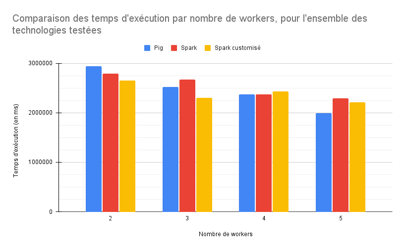
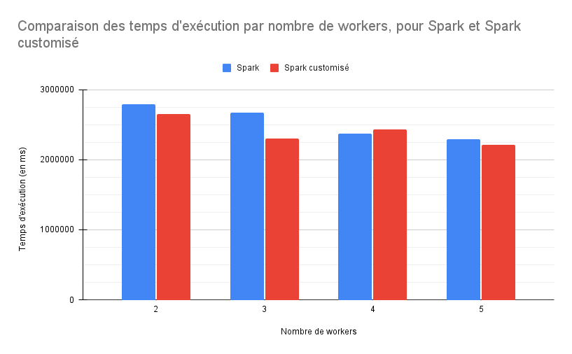

# Homework Pagerank

## Le groupe
Notre groupe est composé de 3 étudiants de master 2 en ALMA à Nantes Université :
* [Quentin Gomes Dos Reis](https://github.com/QGdev)
* [Rodrigue Meunier](https://github.com/Rod4401)
* [Matthéo Lécrivain](https://github.com/MattheoLec)

## Sujet
Le sujet est disponible sur [Madoc](https://madoc.univ-nantes.fr/mod/assign/view.php?id=1952911).
Voici une copie : 
```
Bonjour,

Je veux avoir une comparaison des performances sur pagerank, entre une implantation Pig et une implantation PySpark (Comme dans la vidéo NDSI 2012).

Je veux plusieurs configurations de cluster -> 1 noeuds, 2 noeuds, 4 noeuds (mais gardez le même hardware CPU/RAM par noeud , sinon les résultats ne sont pas comparables).

Les données sont dans: gs:///public_lddm_data/

Mes code sources sont dispos à: https://github.com/momo54/large_scale_data_management

Les résultats doivent être présentés sur un github ou gitlab avec le code source et les résultats d'exp dans le README. Je veux voir quelle est l'entité avec le plus grand page rank :).

Le rendu est donc une URL.

Faites attention au positionnement des données (voir l’article NSDI), je veux que vous évitiez le shuffle pour pagerank/neighbours.
```
## Description du projet
L'objectif de ce travail consiste à évaluer les performances de l'algorithme de pagerank entre la version [PIG](https://pig.apache.org/) et [Spark](https://spark.apache.org) sur 
[Google Cloud Plateform](https://cloud.google.com).<br>
Pour cela nous avions à notre disposition plusieurs ressources :
* 50$ de crédit par personne sur Google CLoud Platform pour nous permettre de créer et d'utiliser des clusters sur le cloud
* Une implémentation de pagerank en Apache PIG
* Une implémentation de pagerank en [PySpark](https://spark.apache.org/docs/latest/api/python/index.html)

## Réalisation du benchmark

### Les scripts bash utilisés
Tous les scripts sont contenus dans des dossiers spécifiques à chaque technologie qui sont eux-mêmes au sein du dossier [scripts]((https://github.com/QGdev/M2S1-LargeScaleDataManagement-Project/blob/main/scripts)).

Chacun de ses dossiers contiennent des scripts bash permettant de créer un cluster et d'exécuter le pagerank spécifique aux technologies testées, on y retrouve :

* [pig.sh](https://github.com/QGdev/M2S1-LargeScaleDataManagement-Project/blob/main/scripts/pig/pig.sh) : Permet de tester le pagerank avec [Pig](https://fr.wikipedia.org/wiki/Apache_Pig) en exécutant le fichier Python [dataproc.py](https://github.com/QGdev/M2S1-LargeScaleDataManagement-Project/blob/main/scripts/pig/dataproc.py).
* [spark-classic.sh](https://github.com/QGdev/M2S1-LargeScaleDataManagement-Project/blob/main/scripts/spark/spark-classic.sh) : Permet de tester le pagerank avec [PySpark](https://spark.apache.org/docs/latest/api/python/index.html) mais de avec le script original fourni en exécutant le fichier Python [pagerank-classic.py](https://github.com/QGdev/M2S1-LargeScaleDataManagement-Project/blob/main/scripts/spark/pagerank-classic.py).
* [spark-optimised.sh](https://github.com/QGdev/M2S1-LargeScaleDataManagement-Project/blob/main/scripts/spark/spark-optimised.sh) : Permet de tester le pagerank avec [PySpark](https://spark.apache.org/docs/latest/api/python/index.html) mais de avec le script dérivé du script original en exécutant le fichier Python [pagerank-optimised.py](https://github.com/QGdev/M2S1-LargeScaleDataManagement-Project/blob/main/scripts/spark/pagerank-optimised.py).

### Paramètres algorithme pagerank
Pour l'algorithme de pagerank, il n'est possible que de jouer sur un seul paramètre, le nombre d'itérations de l'algorithme sur le jeu de données (plus ce nombre est élevé plus les indices de pagerank vont se propager loin). Dans notre cas ce paramètre est fixé à **3 itérations** et cela pour tous les technologies.


### Variable ajustée pour le benchmark
Ici le but de ce benchmark va être de mesurer la performance des technologies en fonction du nombre de workers employés au sein du cluster.
Dans notre cas, nous ferons varier cette dernière sur les valeurs suivantes:
* 2 workers
* 3 workers
* 4 workers
* 5 workers


### Matériel
Les benchmarks ont été réalisés sur les mêmes datacenters Google à savoir *europe-west-6c (Zurich, Suisse)* et les données sont stockés sur le bucket Google *gs:///public_lddm_data/*.<br>
Une fois les calculs effectués les données ont été stockées sur le datacenter Google *europe-west-1*.

Concernant la configuration de noeuds, les noeuds dits "workers" et le noeud principal ont été configurés avec des configurations identiques dites *n1-standard-4* exécutant l'image *2.0-debian10*. Chaque noeuds possédait un espace disque de 50Go.

La configuration *n1-standard-4* a pour caractéristiques :
| Processeurs virtuels | Mémoire (Go) | Nombre max. de disques persistants | Taille totale max. des disques persistants (Tio) | SSD local | Bande passante de sortie maximale (Gbit/s) |
| -------------------- | ------------ | ---------------------------------- | ------------------------------------------------ | --------- | ------------------------------------------ |
| 4                    | 15           | 128                                | 257                                              | Oui       | 10                                         |

**D'après [https://cloud.google.com/compute/docs/general-purpose-machines](https://cloud.google.com/compute/docs/general-purpose-machines?hl=fr#n1-standard), en date du 27/10/2023**


## Résultats

### Benchmarks

Les benchmarks ont été réalisés pour chaque technologie en faisant varier le nombre de workers comme indiqué précédemment.

#### Pig
| Nombre de workers | Temps d'exécution |
| ----------------- | ----------------- |
| 2 | 49min 02s 450ms <br> ~2942450 ms |
| 3 | 41min 59s 983ms <br> ~2519983 ms |
| 4 | 39min 28s 539ms <br> ~2368539 ms |
| 5 | 33min 12s 746ms <br> ~1992746 ms |

#### Spark
| Nombre de workers | Temps d'exécution |
| ----------------- | ----------------- |
| 2 | 46min 26s 277ms <br> ~2786277ms |
| 3 | 44min 35s 995ms <br> ~2675995ms |
| 4 | 39min 30s 678ms <br> ~2370678ms |
| 5 | 38min 16s 472ms <br> ~2296472ms |

#### Spark modifié
| Nombre de workers | Temps d'exécution |
| ----------------- | ----------------- |
| 2 | 44min 08s 723ms <br> ~2648723ms |
| 3 | 38min 20s 164ms <br> ~2300164ms |
| 4 | 40min 34s 209ms <br> ~2434209ms |
| 5 | 36min 52s 253ms <br> ~2212253ms |

### La meilleure technologie en fonction du nombre de workers
| Nombre de workers | Temps d'exécution | Technologie |
| ----------------- | ----------------- | ----------- |
| 2 | xxx | pig/spark/spark modifié |
| 3 | xxx | pig/spark/spark modifié |
| 4 | xxx | pig/spark/spark modifié |
| 4 | xxx | pig/spark/spark modifié |

### Notre TOP 10
Nous avons également effectué des calculs afin d'obtenir les 10 meilleurs pages selon la valeur de pagerank calculée. <br>
Le résultat est disponible au sein du fichier  et mis en forme au sein du tableau ci-dessous.

| Position | Page                                                       | Valeur du pagerank  |
|----------|------------------------------------------------------------|---------------------|
| 1        | <http://dbpedia.org/resource/Living_people>                 | 36794.33146754483   |
| 2        | <http://dbpedia.org/resource/United_States>                 | 13201.3401519812    |
| 3        | <http://dbpedia.org/resource/Race_and_ethnicity_in_the_United_States_Census> | 10371.16200554135   |
| 4        | <http://dbpedia.org/resource/List_of_sovereign_states>      | 5195.347361862181   |
| 5        | <http://dbpedia.org/resource/United_Kingdom>                | 4923.821309315207   |
| 6        | <http://dbpedia.org/resource/Year_of_birth_missing_%28living_people%29> | 4615.793976336983   |
| 7        | <http://dbpedia.org/resource/France>                        | 4595.730518177776   |
| 8        | <http://dbpedia.org/resource/Germany>                       | 4111.195621667527   |
| 9        | <http://dbpedia.org/resource/Canada>                        | 3765.461560612457   |
| 10       | <http://dbpedia.org/resource/Animal>                        | 3692.395898434715   |

### Comparaisons




