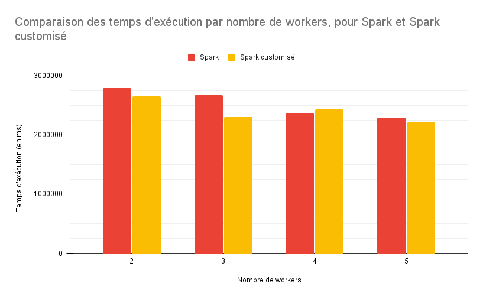

# Homework Pagerank

## Le groupe
Notre groupe est composé de 3 étudiants de master 2 en ALMA à Nantes Université :
* [Quentin Gomes Dos Reis](https://github.com/QGdev)
* [Rodrigue Meunier](https://github.com/Rod4401)
* [Matthéo Lécrivain](https://github.com/MattheoLec)

## Sujet
Le sujet est disponible sur [madoc](https://madoc.univ-nantes.fr/mod/assign/view.php?id=1952911).
Voici une copie : 
```
Bonjour,

Je veux avoir une comparaison des performances sur pagerank, entre une implantation Pig et une implantation PySpark (Comme dans la vidéo NDSI 2012).

Je veux plusieurs configurations de cluster -> 1 noeuds, 2 noeuds, 4 noeuds (mais gardez le même hardware CPU/RAM par noeud , sinon les résultats ne sont pas comparables).

Les données sont dans: gs:///public_lddm_data/

Mes code sources sont dispos à: https://github.com/momo54/large_scale_data_management

Les résultats doivent être présentés sur un github ou gitlab avec le code source et les résultats d'exp dans le README. Je veux voir quelle est l'entité avec le plus grand page rank :).

Le rendu est donc une URL.

Faites attention au positionnement des données (voir l’article NSDI), je veux que vous évitiez le shuffle pour pagerank/neighbours.
```
## Description du projet
L'objectif de ce travail consiste à évaluer les performances de l'algorithme de pagerank entre la version pig et spark sur 
[Google Cloud Plateform ](https://cloud.google.com).
Pour cela nous possédons plusieurs ressources à notre disposition :
* 50$ de crédit sur google cloud pour nous permettre de créer et d'utiliser des clusters sur le cloud
* Une implémentation de pagerank en pig
* Une implémentation de pagerank en spark


## Résultats

### Les scripts bash utilisés
Tous les scripts sont présent dans le dossier scripts.
Le dossier contient :
* [pig.sh](https://github.com/QGdev/M2S1-LargeScaleDataManagement-Project/blob/main/scripts/pig.sh) : Contient le code permettant de créer un cluster et d'executer pagerank avec [Pig](https://fr.wikipedia.org/wiki/Apache_Pig)
* [spark.sh](https://github.com/QGdev/M2S1-LargeScaleDataManagement-Project/blob/main/scripts/spark.sh) : Contient le code permettant de créer un cluster et d'executer pagerank avec [Spark](https://fr.wikipedia.org/wiki/Apache_Spark)
* [snakefile](https://github.com/QGdev/M2S1-LargeScaleDataManagement-Project/blob/main/scripts/snakefile) : Contient le code [Snakemake](https://snakemake.readthedocs.io/en/stable/index.html) permettant d'opérer toutes les executions et de reprendre si échec pour éviter de perdre toutes les données obtenues.

### Benchmarks

#### Pig
| Nombre de workers | Tps d'exécution  
| ------------- | -------------|
| 2 | 49min 2s 450ms <br> ~2942450 ms |
| 3 | 41min 59s 983ms <br> ~2519983 ms |
| 4 | 39min 28s 539ms <br> ~2368539 ms |
| 5 | 33min 12s 746ms <br> ~1992746 ms  |

#### Spark
| Nombre de workers | Tps d'exécution  
| ------------- | -------------|
| 2 | 46min 26s 277ms <br> ~2786277ms |
| 3 | 44min 35s 995ms <br> ~2675995ms |
| 4 | 39min 30s 678ms <br> ~2370678ms |
| 5 | 38min 16s 472ms <br> ~2296472ms |

#### Spark "customisé"
| Nombre de workers | Tps d'exécution  
| ------------- | -------------|
| 2 | 44min 08s 723ms <br> ~2648723ms |
| 3 | 38min 20s 164ms <br> ~2300164ms |
| 4 | 40min 34s 209ms <br> ~2434209ms |
| 5 | 36min 52s 253ms <br> ~2212253ms |

### La meilleure techno
| Rank | Tps d'exécution | Techno |
| ------------- | -------------| -------------|
| 1 | xxx | pig/spark |
| 2 | xxx | pig/spark |
| 3 | xxx | pig/spark |

### Notre TOP 10
Nous avons également effectué des calculs afin d'obtenir les 10 meilleurs pages selon la valeur de pagerank calculée. <br>
Le résultat est disponible au sein du fichier  et mis en forme au sein du tableau ci-dessous.

| Position | Page                                                       | Valeur du pagerank  |
|----------|------------------------------------------------------------|---------------------|
| 1        | <http://dbpedia.org/resource/Living_people>                 | 36794.33146754483   |
| 2        | <http://dbpedia.org/resource/United_States>                 | 13201.3401519812    |
| 3        | <http://dbpedia.org/resource/Race_and_ethnicity_in_the_United_States_Census> | 10371.16200554135   |
| 4        | <http://dbpedia.org/resource/List_of_sovereign_states>      | 5195.347361862181   |
| 5        | <http://dbpedia.org/resource/United_Kingdom>                | 4923.821309315207   |
| 6        | <http://dbpedia.org/resource/Year_of_birth_missing_%28living_people%29> | 4615.793976336983   |
| 7        | <http://dbpedia.org/resource/France>                        | 4595.730518177776   |
| 8        | <http://dbpedia.org/resource/Germany>                       | 4111.195621667527   |
| 9        | <http://dbpedia.org/resource/Canada>                        | 3765.461560612457   |
| 10       | <http://dbpedia.org/resource/Animal>                        | 3692.395898434715   |

### Comparaisons




## Licence

